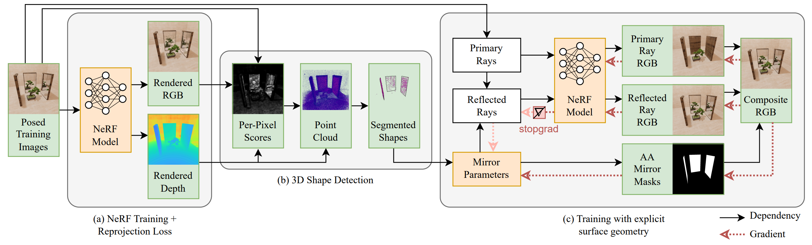

<h1 align="center" id="heading">NeRFs are Mirror Detectors: Using Structural Similarity for Multi-View Mirror Scene Reconstruction with 3D Surface Primitives</h1>

<p align="center">
    <p align="center">
		<b><a href="https://cg.cs.uni-bonn.de/person/m-sc-leif-van-holland">Leif Van Holland</a><sup>1</sup></b>
        &nbsp;·&nbsp;
		<b><a href="https://www.tudelft.nl/en/eemcs/the-faculty/departments/intelligent-systems/computer-graphics-and-visualization/people/michael-weinmann">Michael Weinmann</a><sup>2</sup></b>
        &nbsp;·&nbsp;
		<b><a href="https://cg.cs.uni-bonn.de/person/m-sc-jan-uwe-mueller">Jan Müller</a><sup>1</sup></b>
        &nbsp;·&nbsp;
        <b><a href="https://cg.cs.uni-bonn.de/person/dr-patrick-stotko">Patrick Stotko</a><sup>1</sup></b>
        &nbsp;·&nbsp;
        <b><a href="https://cg.cs.uni-bonn.de/person/prof-dr-reinhard-klein">Reinhard Klein</a><sup>1</sup></b>
    </p>
    <p align="center">
        <sup>1</sup>University of Bonn &nbsp; &nbsp; <sup>2</sup>Delft University of Technology
    </p>
    <h3 align="center">WACV 2025</h3>
    <h3 align="center">
        <a href="https://arxiv.org/abs/2501.04074">Paper (arxiv)</a>
        &nbsp; | &nbsp;
        <a href="https://cg.cs.uni-bonn.de/publication/holland-2025-nerfs-are-mirror-detectors">Project Page</a>
		&nbsp | &nbsp;
        <a href="https://cg.cs.uni-bonn.de/backend/v1/files/code/TraM_NeRF/tramnerf_scenes.zip">Data</a>
    </h3>
    <div align="center"></div>
</p>

<p align="center">
    
</p>

Code for reproducing the results will be released soon.

## Abstract

While neural radiance fields (NeRF) led to a breakthrough in photorealistic novel view synthesis, handling mirroring surfaces still denotes a particular challenge as they introduce severe inconsistencies in the scene representation. Previous attempts either focus on reconstructing single reflective objects or rely on strong supervision guidance in terms of additional user-provided annotations of visible image regions of the mirrors, thereby limiting the practical usability. In contrast, in this paper, we present NeRF-MD, a method which shows that NeRFs can be considered as mirror detectors and which is capable of reconstructing neural radiance fields of scenes containing mirroring surfaces without the need for prior annotations. To this end, we first compute an initial estimate of the scene geometry by training a standard NeRF using a depth reprojection loss. Our key insight lies in the fact that parts of the scene corresponding to a mirroring surface will still exhibit a significant photometric inconsistency, whereas the remaining parts are already reconstructed in a plausible manner. This allows us to detect mirror surfaces by fitting geometric primitives to such inconsistent regions in this initial stage of the training. Using this information, we then jointly optimize the radiance field and mirror geometry in a second training stage to refine their quality. We demonstrate the capability of our method to allow the faithful detection of mirrors in the scene as well as the reconstruction of a single consistent scene representation, and demonstrate its potential in comparison to baseline and mirror-aware approaches.


## Citation

If you use the code for your own research, please cite our work as

```
@misc{vanholland2025nerfsmirrordetectorsusing,
      title={NeRFs are Mirror Detectors: Using Structural Similarity for Multi-View Mirror Scene Reconstruction with 3D Surface Primitives}, 
      author={Leif Van Holland and Michael Weinmann and Jan U. Müller and Patrick Stotko and Reinhard Klein},
      year={2025},
      eprint={2501.04074},
      archivePrefix={arXiv},
      primaryClass={cs.CV},
      url={https://arxiv.org/abs/2501.04074}, 
}
```

## Acknowledgements

This work has been funded by the DFG project KL 1142/11-2 (DFG Research Unit FOR 2535 Anticipating Human Behaviour), and additionally by the Federal Ministry of Education and Research of Germany and the state of North-Rhine Westphalia as part of the Lamarr-Institute for Machine Learning and Artificial Intelligence and by the Federal Ministry of Education and Research under Grant No. 01IS22094E WEST-AI.